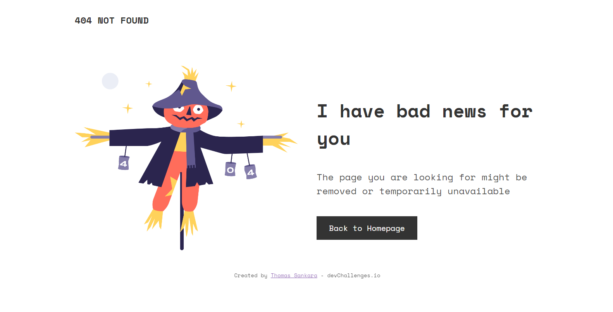

<!-- Please update value in the {}  -->

<h1 align="center">DevChallenge - 404 Not Found UI Only</h1>

   Solution for a challenge from  <a href="http://devchallenges.io" target="_blank" rel="noreferrer">Devchallenges.io</a>.

  <h3>
    <a href="https://tsbsankara-404-not-found.netlify.app">
      Demo
    </a>
     | 
    <a href="https://devchallenges.io/solutions/mXj91orvfYaKPeK6fIrr">
      Solution
    </a>
     | 
    <a href="https://devchallenges.io/challenges/wBunSb7FPrIepJZAg0sY">
      Challenge
    </a>
  </h3>

<!-- TABLE OF CONTENTS -->

## Table of Contents

- [Overview](#overview)

  - [Built With](#built-with)

    Vanilla HTML and CSS

- [Features](#features)

  UI Only 404 not found page.

- [Contact](#contact)

  Contact: [Thomas Sankara](https://tsbsankara.com)

- [Acknowledgements](#acknowledgements)

<!-- OVERVIEW -->

## Overview

## Features

<!-- List the features of your application or follow the template. Don't share the figma file here :) -->

This application/site was created as a submission to a [DevChallenges](https://devchallenges.io/challenges) challenge. The [challenge](https://devchallenges.io/challenges/wBunSb7FPrIepJZAg0sY) was to build an application to complete the given user stories.

## Contact

- Website [Website](https://tsbsankara.com)
- GitHub [@SankThomas](https://github.com/SankThomas)
- Twitter [@TSBSankara](https://twitter.com/@TSBSankara)
